Computie68k
===========

###### *Started October 03, 2019*

Computie is a series of single board computers using the 68010 and 68030 CPUs, along with a simple unix-like
operating system written in C, with preemptive multitasking via a timer interrupt provided by the 68681
serial port controller that is common to all boards.

k30-SBC is the newest board, using a surface-mount 68030 CPU, 2MB of Static RAM, 512KB of Flash for the boot
software and monitor program, and a CompactFlash slot.

68k-SBC is a single board computer with a 68010 CPU, 1MB SRAM, 1MB Flash, and a 68681 Dual UART controller.

68k-SMT is a mostly identical design using SMT and PLCC components.  A CompactFlash card slot has been added
to this version, but it is also possible to connect a simple breadboarded version to 68k-SBC.

For more details on how I got up and running, check out [Bootstrapping a Homebuilt Computer Using An Arduino](https://transistorfet.github.io/posts/2021-09-bootstrapping_with_arduino.html)

For instructions on getting a board set up and software compiled, check out [INSTALL.md](INSTALL.md)

The Operating System
--------------------

Currently it doesn't have a name.  It's largely based on reading Operating Systems Design and Implementation 2ed by
Andrew S. Tanenbaum, although I've gone with a monolithic design, at least for the time being, for the simplicity of
it.  It can do preemptive multitasking using the 68681 timer.  It also has an implementation of the minix version 1
filesystem, which uses RAM (through a device driver) to store the data, or a Compact Flash card connected as an IDE
device.  The second serial port can be configured as a SLIP device, with a basic implementation of UDP and TCP through
a BSD sockets-style API, and an NTP command is provided for updating the system time on boot (when booting from disk).

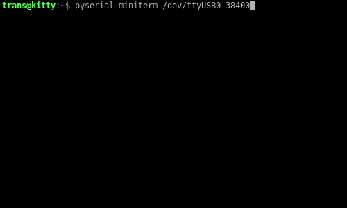

The above video shows connecting over serial from a modern PC and resetting the hardware to run the monitor in ROM
which displays the welcome message.  The kernel is already loaded in RAM, so running the boot command will boot
the kernel which then starts the shell.  From the shell, some basic file operations and the ps command are shown.

The k30 Single Board Computer
-----------------------------

The k30 is the latest version, using a 68030.  It has 2MB SRAM, 512KB Flash, a 68681 Dual UART, and a CompactFlash.
It's as similar to 68k-SMT as possible while still upgrading the CPU.  It doesn't use a programmable logic device for
the glue logic as many similar projects use, instead opting for eleven 74 series logic chips.  It still manages to
use the full 32-bit data bus for RAM, but only one flash chip is used which has an 8-bit data bus in order to reduce
complexity.  Most of the software will be run from RAM, so this shouldn't be a problem.

[k30 Schematics](https://github.com/transistorfet/computie/raw/main/hardware/k30-SBC/k30-SBC.pdf)

DIP switches are used to select the time delay to use for the CompactFlash card (which is interfaced directly to the
CPU), to enable the bus error watchdog timer, and to enable/disable the cache and MMU features.

k30 Revision 2
--------------

This revision fixes the issues of the previous one.  The compact flash card can now be accessed, and the OS is able
to boot entirely from the compact flash card without issue.

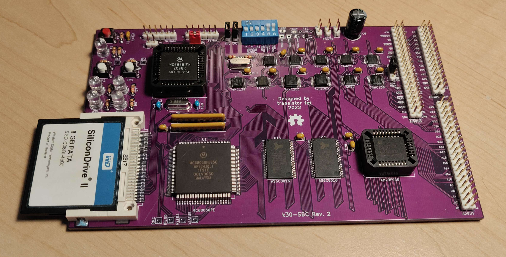

k30 Revision 1
--------------

I made a mistake and used the wrong size footprint for the two 74HC253s, which only come in a 16SSOP package and not
the TSSOP package used by the other logic chips.  The footprint used were 4.9 mm wide but should have been 6.2mm.
Luckily I managed to bend the pins under the body of the chips which was enough to get all the pins touching all the
pads.  It was very tricky to solder, and there was a bridge between DS3 and ground which was very difficult to get
unstuck, but it's working now.

I also made a mistake in the DSACK signals used to terminate a memory cycle, specifically for the compact flash card.
The logic was inverted, so the card was inaccessible, and my attempts at fixing it fried the clock, although it might
have just been the crystal.  I set the project aside for a while and then made a new revision.  For details on the
issues, see the [errata](https://github.com/transistorfet/computie/raw/main/hardware/k30-SBC/revisions/k30-SBC-rev1-errata.txt)

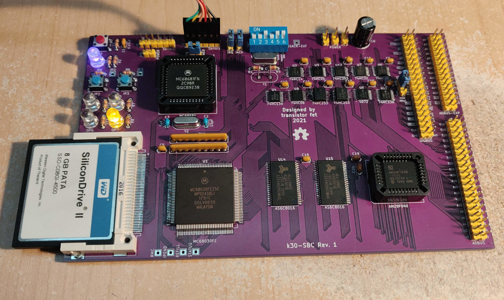
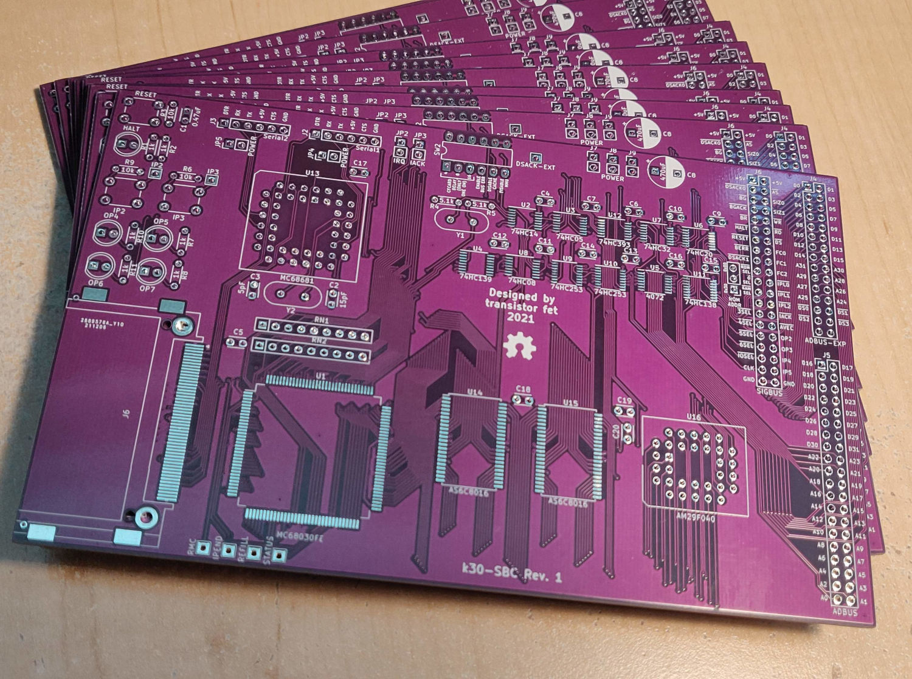

The 68k Single Board Computer
-----------------------------

A simple single board computer using a Motorola 68010 CPU, which can connect to a host computer via USB/TTL-Serial.
It has a bus for connecting a supervisor arduino or expansion devices, but it can operate standalone using the onboard
UARTs.  It has 1MB of onboard Flash, 1MB of onboard SRAM, and a 68681 Dual UART chip with GPIO.  Some of the GPIO
pins are wired to 4 general purpose LEDs and 2 general purpose buttons.

[68k Board Schematics](https://github.com/transistorfet/computie/raw/main/hardware/68k-SBC/68kBoard.pdf)

The serial ports require external TTL-to-something conversion and are designed to be used with an FTDI USB-to-Serial
cable or adapter.  Two optional jumpers can be used to supply power to the board from one of the USB ports (only one
should be jumped at a time, and only if the onboard power supply is disconnected).  It typically takes about 365mA at
5V to power.

Two jumpers are provided to select what address the ROM will appear in (either 0x0000 or 0x2000), and whether to enable
onboard DTACK generation for address space 0x0000.  By moving the ROM to 0x2000 and disabling DTACK in 0x0000, a
connected arduino can boot the 68000 directly.

I decided to use discrete 74 Series chips for the glue logic to keep it simple and easy for others to build.  I tried
to minimize the amount of logic chips needed, so it doesn't have a watchdog timer to trigger a bus error when an
unmapped address is accessed.

It's currently clocked at 12MHz, although there seems to be an issue with the arduino's DTACK generation at that speed.
It previously was working at 10MHz on the rev0 board.

The SBC version uses all DIP packaged chips and through-hole parts.  The SMT version uses surface mount chips for the
logic and ram, and PLCC packaged chips for the rest.  A CompactFlash socket and a 74HC32 to accommodate it has been
added and the power supply has been removed, but it is otherwise the same design.

SMT Revision 1
--------------

SBC Revision 2
--------------

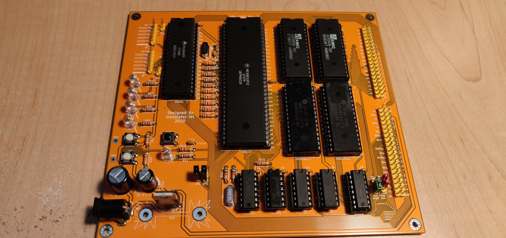

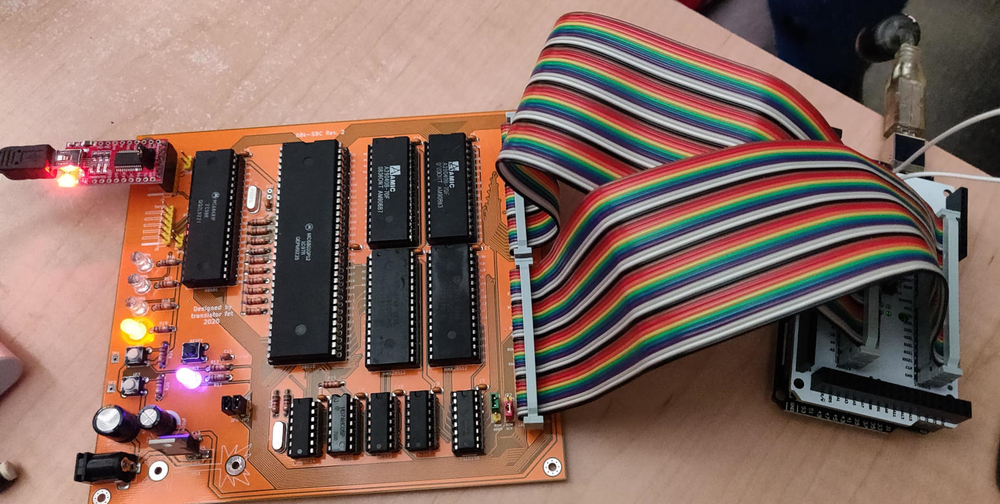
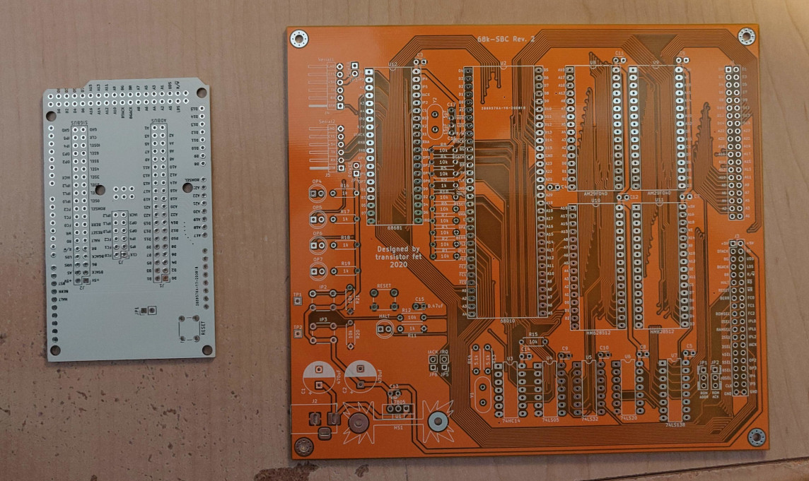

SBC Revision 0
--------------

This version has 64KB of EEPROM instead of Flash, and doesn't have onboard interrupt circuitry.  It started off with a
68000 CPU, but that was later upgraded to a 68010 to allow for relocatable interrupt tables when using off-board
interrupt circuitry.

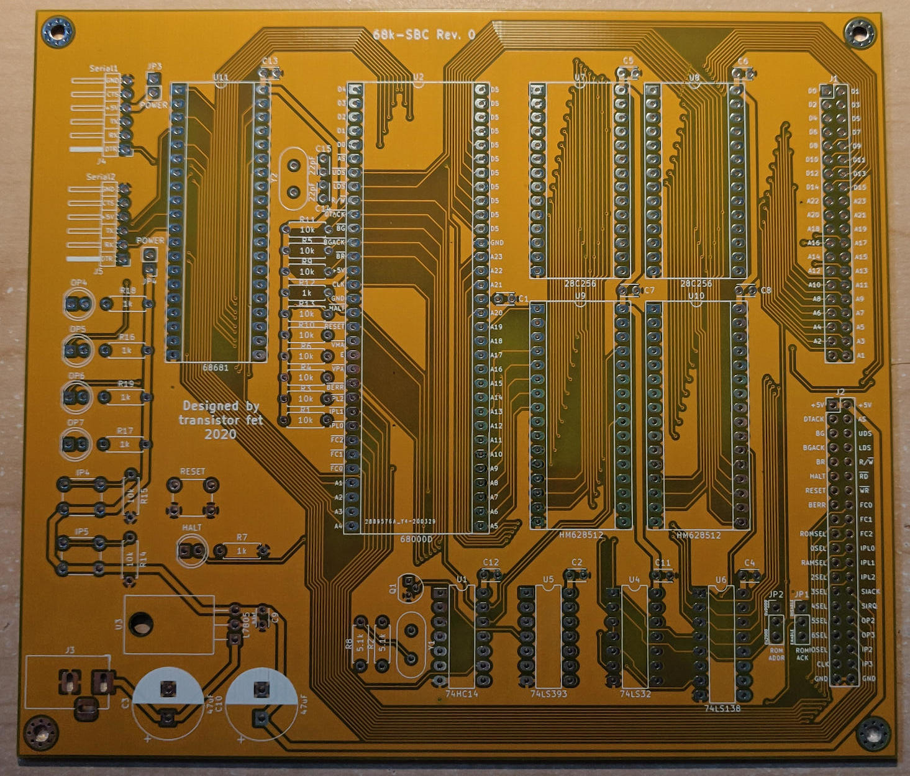
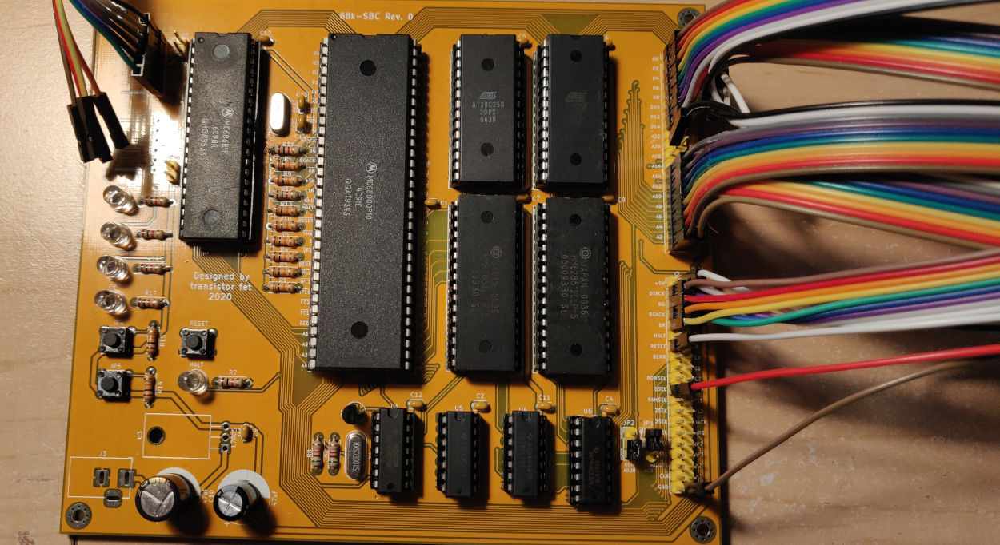

I made a mistake and left out the logic for LDS/UDS in the chip select for the high and low memory chips.  When writing
a single byte to memory, it would also attempt to write to both the high and low chips, instead of only one.  Thanks to
a poster on EEVblog who suggested patching it with a P-channel MOSFET shown soldered to the back of the SRAM chips to
interpose the UDS/LDS signals into the chip selects, with the original traces cut.

Breadboard Version
------------------

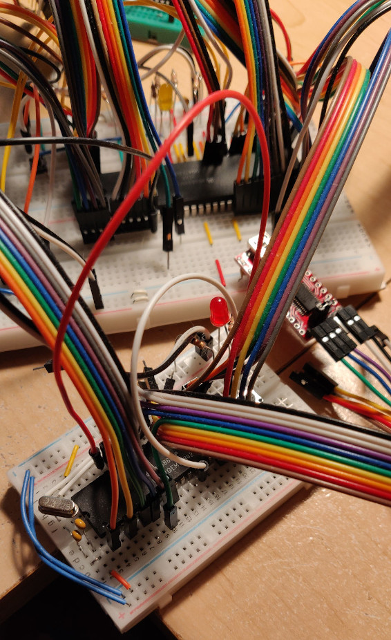

Operating System Booting From Monitor/Compact Flash on 68k-SMT
--------------------------------------------------------------

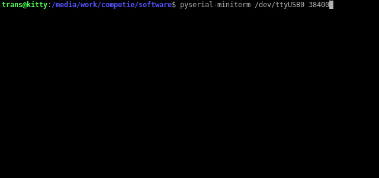

The above video shows connecting over serial from a modern computer after first powering the board on.  The monitor
runs first, giving the ">" prompt.  The bootloader has been burnt into flash at address 0x20000.  From the monitor, the
boot loader is run, which then loads the kernel from the attached compact flash card.  Each period (.) character
printed represents 1 kilobyte of data loaded from disk).  The boot loader then jumps to the loaded kernel, which
displays boot messages before running the init process from disk.  The init process first runs `sh /etc/rc`", which runs
the ntpdate command to update the system time.  It then runs an interactive shell.

Some commands are shown after boot, and then the httpd program is run (which has forking disabled for the time being).
From another computer, the curl command is run to issue a request to the board.  The httpd program responds with the
data "This is a secret message"

References
----------

- [S-100 68000 CPU Board](http://s100computers.com/My%20System%20Pages/68000%20Board/68K%20CPU%20Board.htm)
- [Tiny68K, 68000 SBC](https://www.retrobrewcomputers.org/doku.php?id=boards:sbc:tiny68k)
- [Motorola 68000 computer](https://hackaday.io/project/7242-motorola-68000-computer)
- [68k Single Board Computer](https://www.kswichit.com/68k/68k.html)
- [Kiwi - a 68k Homebrew Computer](https://www.ist-schlau.de/hardware.html)

- [ECB KISS-68030](https://www.retrobrewcomputers.org/doku.php?id=boards:ecb:kiss-68030:start)
- [Gryphon 68030](https://www.retrobrewcomputers.org/doku.php?id=boards:sbc:gryphon_68030:start)
- [T030](https://hackaday.io/project/9439-t030)
- [Building a 68030 computer in 5 stages](https://hackaday.io/project/164041-building-a-68030-computer-in-5-stages)
- [Blitz - 32bit 68030 homebrew with an ISA bus](https://blog.notartyoms-box.net/blitz/)

