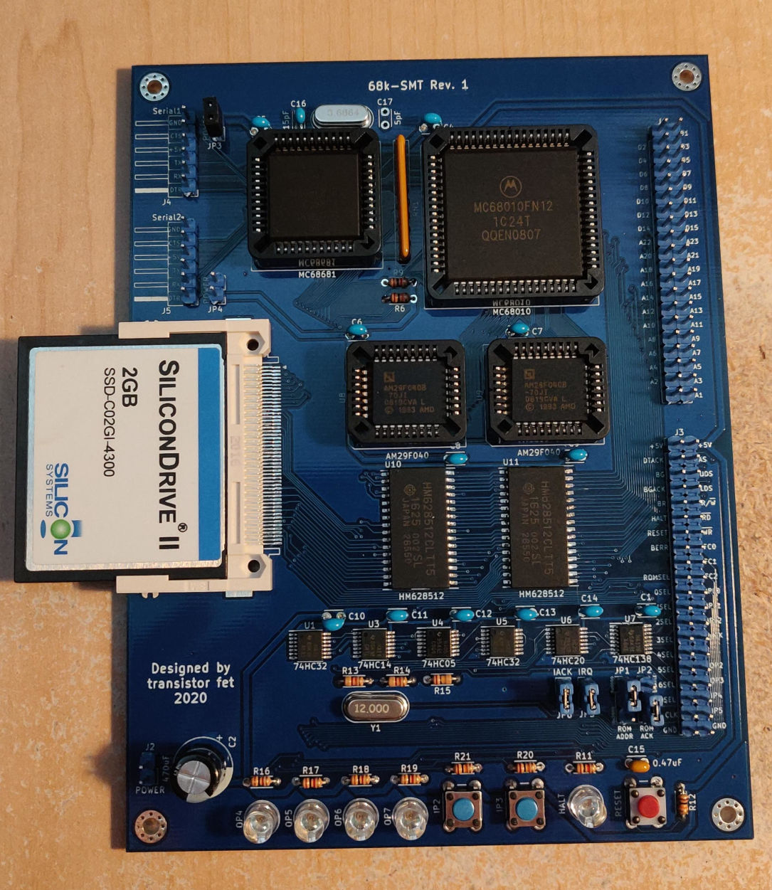
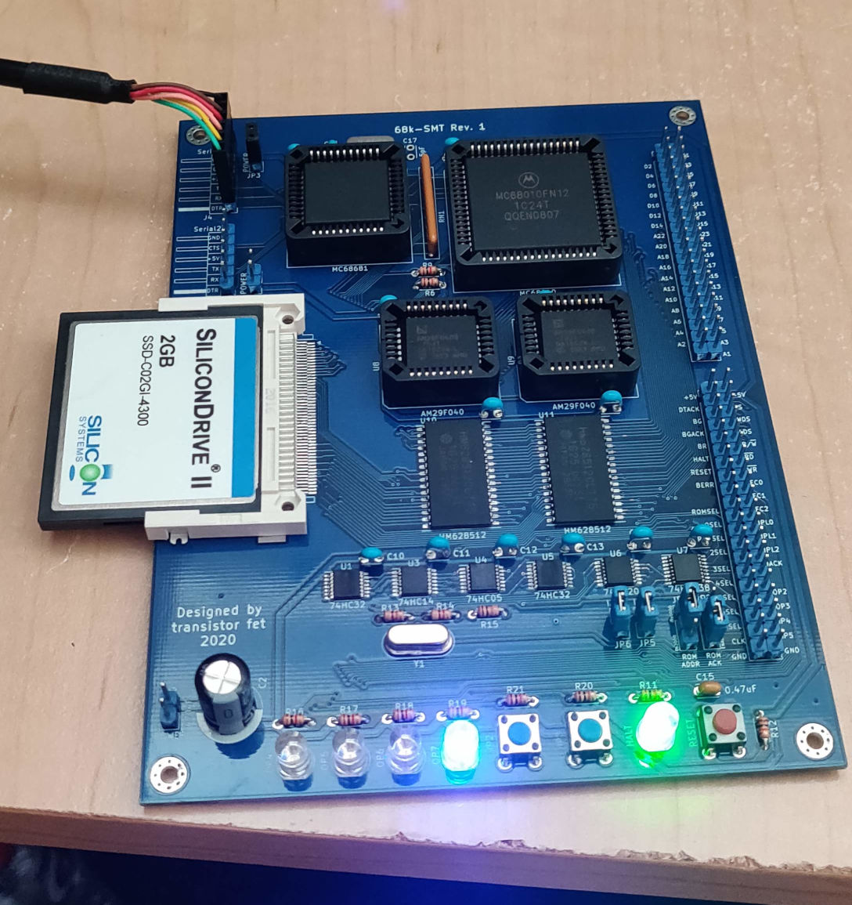
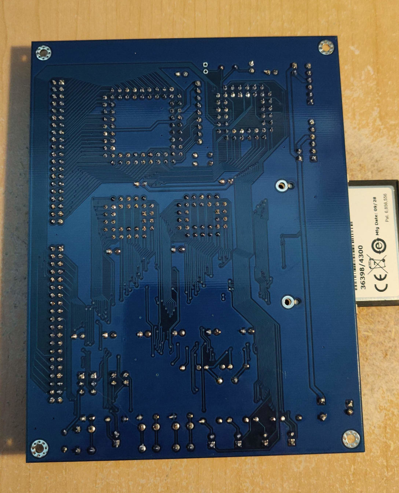

68k-SMT
=======

Status: Built & Tested

Latest: Rev.1

### About
This is an almost identical version as the 68k-SBC Rev.2 but using either PLCC chips or surface
mount chips, and with the addition of a CompactFlash card slot.  This was the first board I made
with surface mount chips, and I pushed myself a bit with the TSSOP logic chips, which were the
hardest to solder.  The CompactFlash socket was the easiest to solder because it has holes that
aligned the pins with the pad perfectly.  I also had issues with taking too much solder off the
memory chips causing micro-fractures in the solder that resulted in crashing/locking up.

The goal here was to learn surface mount soldering techniques so that I could attempt a 68030 based
design.  I had lots of $10 QFP package 68030s, but the PGA packages were about 4 times the price,
plus about $10 CAD including shipping and duties for a PGA socket (which is this [128-pin 13x13 PGA
socket](https://www.peconnectors.com/sockets-pga-cpu-and-memory/hws4514/)

[Revision 1 Notes & Errata](revisions/68k-SMT-rev1-errata.txt)

[Revision 1 Schematic](revisions/68k-SMT-rev1.pdf)

[Revision 1 Gerbers](revisions/68k-SMT-rev1.zip)

