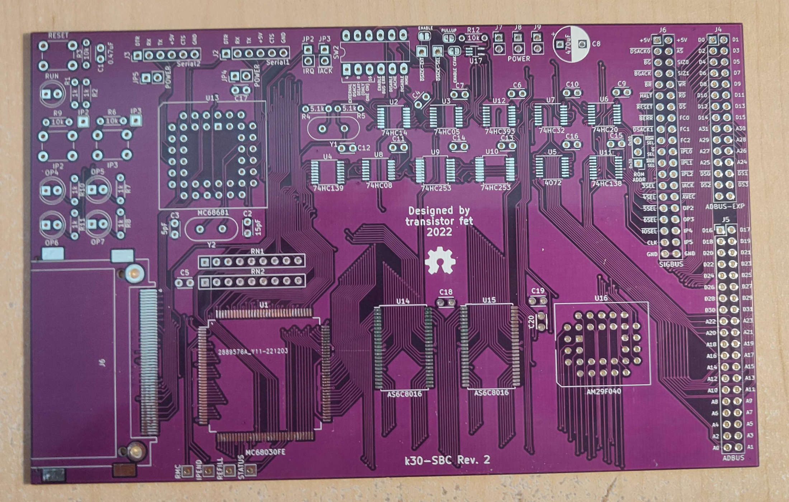

k30-SBC
=======

Status: Built & Tested

Latest: Rev.2

### About
A single board computer with DIP packaged chips.  The only programmable chip is the flash memory, which can
be written in-circuit using the Ardunio-based supervisor shield.

[Revision 2 Notes & Errata](revisions/k30-SBC-rev2-errata.txt)

[Revision 2 Schematic](revisions/k30-SBC-rev2.pdf)

[Revision 2 Gerbers](revisions/k30-SBC-rev2.zip)

